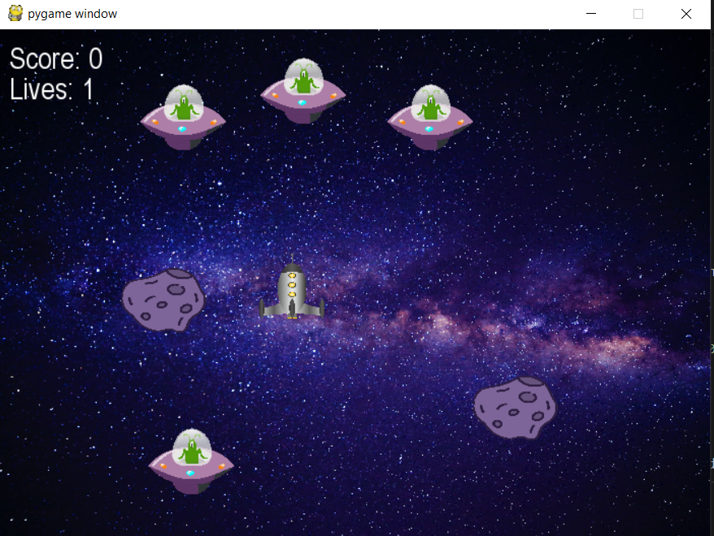

### Spaceshooter2
Game of spaceshooter modified from the shooter game
## Heres an image of the game


## How to play this game?

First you will need to install python3 on visual studio code, download the github extension, as well as downloading the pygame library using the command below

``` bash
    pip install pygame
```

after installing the extensions, you can download the files, open them inside of VS studio code through github and run the game

## have fun!